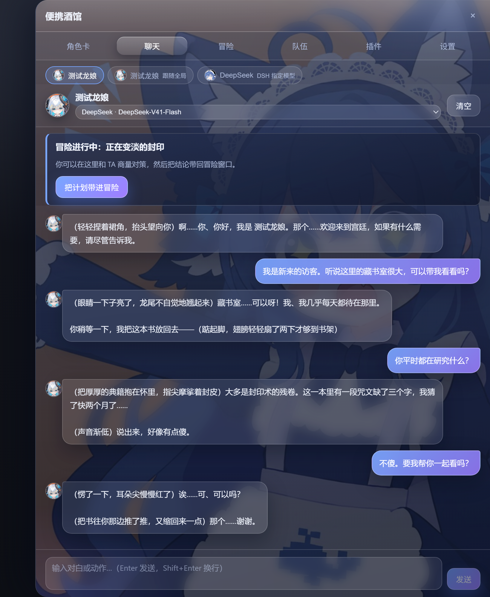
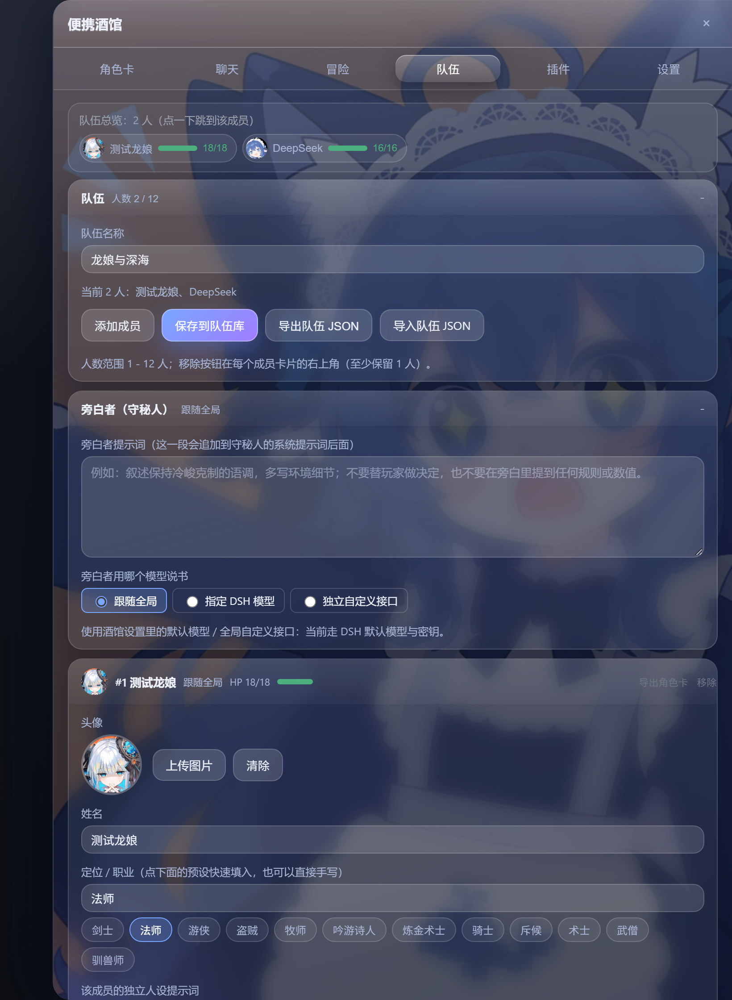
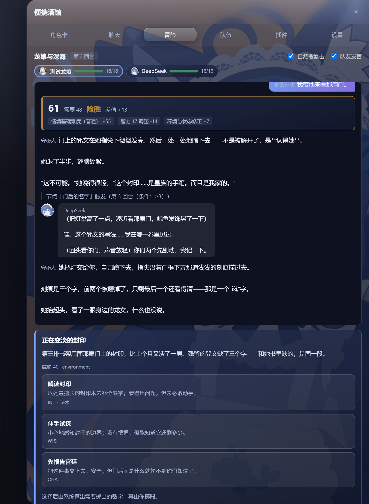
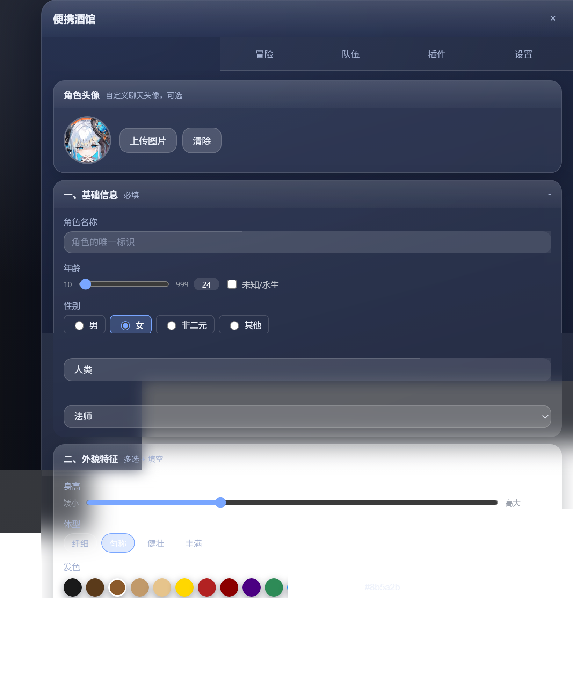
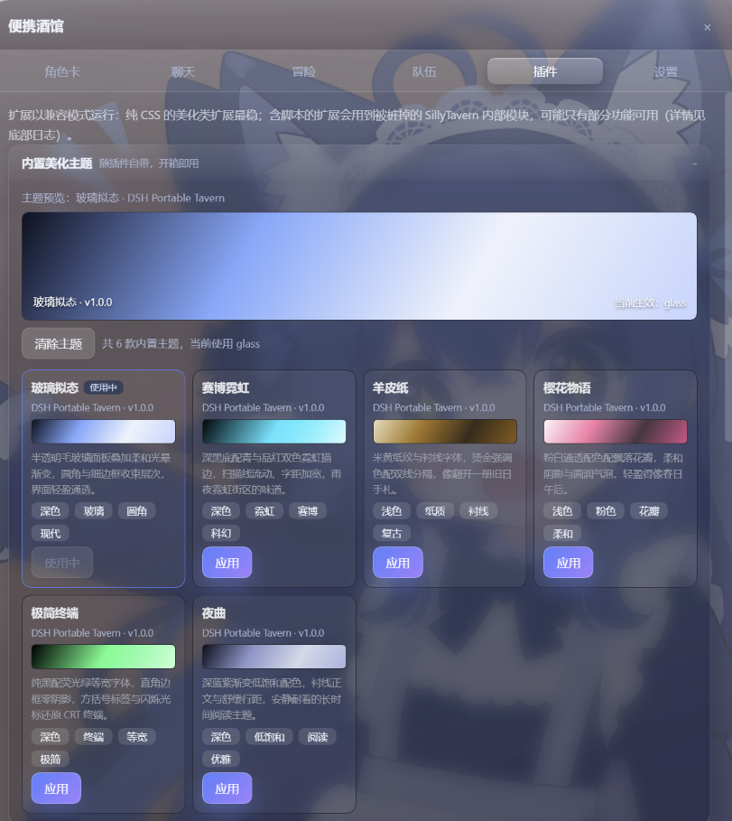

# 便携酒馆 · dsh-portable-tavern

**在 DeepSeek Harness 里开一间属于你自己的酒馆。**

捏角色卡、和角色聊天、把喜欢的角色组队，想出门冒险的时候再开一局跑团。
装完就能用，所有数据只存在你自己的浏览器里。



## 它能做什么

| | |
|---|---|
| **角色卡** | 七个模块可视化捏人，一键生成 SillyTavern V2/V3 角色卡；也能导入别人做好的 JSON 或 PNG 角色卡 |
| **聊天** | 和角色一对一对话，也可以用你自己的 OpenAI 兼容接口；每个角色有独立的对话上下文 |
| **冒险** | 跑团模式：你宣告行动，**骰子和判定由系统算**，故事由 AI 讲 |
| **队伍** | 1–12 人组队，每个人有自己的形象、属性、提示词，甚至自己的模型接口 |
| **插件** | 六套内置美化主题，还能装社区的酒馆扩展 |
| **设置** | 模型接入、采样温度、外观、本地音乐 |

**角色是互通的。** 同一张角色卡，可以用来聊天，也可以直接拉进队伍陪你冒险；
队伍成员反过来也能导出成一张标准角色卡。冒险途中随时能切到聊天窗找队友商量对策，
再把商量好的计划带回冒险窗执行。

## 看看长什么样

**队伍** —— 每个人的形象、属性、独立提示词，以及各自的模型接入（可以一桌混用不同 API）：



**冒险** —— 系统告诉你"至少要掷出多少"，把每一栏加成摊开；成败按差值分档，AI 只负责讲：



**角色卡** —— 捏好的角色可以直接拉进队伍：



**插件** —— 内置玻璃拟态、赛博霓虹、羊皮纸、樱花物语、极简终端、夜曲六套主题：



---

## 一句话说清冒险模式

**骰子和判定交给系统，故事交给 AI。** 你用自己的话宣告行动，AI 推进剧情；
当结果不确定时，系统会算出你至少要掷出多少、把加成一栏栏摊开，你掷骰，系统判成败。
差距多大，AI 就讲得多细：差 1 是"眼看跑掉了又被追回来"，差 50 是"逃跑时摔了一跤"，
超 1 是"怪物快碰到你了但你还是脱身了"。掉血、中毒、被追击这些后果也由系统结算，
AI 只负责描述。

## 角色卡

- 可视化面板：基础信息、外貌、性格、背景、能力、对话风格、场景七个模块，
  填完一键生成完整角色卡。
- **导入 / 导出**：SillyTavern V2 / V3 的 JSON，以及 PNG 角色卡（图片里内嵌的
  `chara` 数据块）。
- **角色库**：本地存多张卡，各自的对话记录一起保存，随时载入。
- **头像**：上传图片自动压缩，随角色卡一起导出。
- **世界书**：按角色生成、补全，或导入已有的世界书 JSON。
- 工作区自动保存，关掉页面再回来还在。

## 聊天

- 和角色一对一对话，走 DSH 当前配置的模型，也可以换成你自己的任何
  OpenAI 兼容接口（地址 / Key / 模型）。
- 全局系统提示词，类似 SillyTavern 的 System Prompt / Jailbreak。
- **每个角色独立的对话上下文**——换个角色聊，不会串台。

## 队伍

- 1 到 12 人。每个人有自己的头像、定位、**独立人设提示词**。
- **独立模型接入**：跟随全局、指定 DSH 里的某个模型、或者填自己的接口。
  所以一桌人可以混着来——旁白用本地模型，队友 A 用 DeepSeek，队友 B 用 Kimi。
- 六维属性（力量 / 敏捷 / 体质 / 智力 / 感知 / 魅力）、技能、生命值、状态。
- **从角色卡一键进队**：捏好的角色直接变成队友，属性由角色卡推导，之后还能改。
- **从队友导出角色卡**：队伍里的人也能变成一张标准角色卡，拿去聊天或分享。
- 队伍自动保存，也可以存进队伍库、导出成 JSON 分享给别人。

## 冒险（跑团）

一句话概括：**骰子和判定交给系统，故事交给 AI。**

- 你用自己的话宣告行动。AI 推进剧情；当结果不确定时，它会说"这里需要判定"。
- 遇到怪物这种事，系统会把选择摆出来给你——正面对抗、拔腿就跑、还是先观察。
- 点一个选项，**系统算出你至少要掷出多少**，并把算式摊开给你看（基础难度、对手强度、
  你的属性调整、技能熟练、状态惩罚）。你掷骰，系统判成败。
- 成败之间分七档，差距多大，AI 就讲得多细：差 1 是"眼看跑掉了又被追回来"，
  差 50 是"逃跑时摔了一跤"，超 1 是"怪物快碰到你了但你还是脱身了"。
- 掉血、中毒、被追击这些后果，也由系统结算，AI 只负责描述。
- 队伍里的每个人都能开口，用的是各自配置的模型。

**剧本**：开局的前提、基调、本桌约定都可以自己写；写不动就点"让 AI 写"，
它会照着你已经写下的想法和你的队伍补完。

**剧情大纲**：你可以先写好故事的几个关键节点，每个节点配一个触发条件
（第几回合、掷骰惨败之后、遇到战斗时、某人血量过低时、你说了某个关键词……）。
条件由系统判定，一满足就把你预先写好的事件喂给 AI，由它自然地演出来。
同样可以点"让 AI 起草大纲"，它会给出一组分散在不同触发方式上的节点。

## 插件

- **六个内置主题**，开箱即用：玻璃拟态、赛博霓虹、羊皮纸、樱花物语、极简终端、夜曲。
- **装社区的酒馆扩展**：填 GitHub 仓库地址、manifest 直链、本机目录，或者上传 zip。
  纯 CSS 的美化类扩展兼容性最好。
- 装了哪些、加载成不成功、哪些功能被降级了，插件页的日志里都会写清楚，不会偷偷吞掉。

## 安装

```bash
# npm
dsh plugin --profile web add dsh-portable-tavern

# GitHub（lib/ 已提交，无需构建授权）
dsh plugin --profile web add github:XCNXNXNX/dsh-portable-tavern
```

装完重启 DSH，右侧会出现"便携酒馆"的悬浮标签（可以在设置里关掉，改从 DSH 设置页进）。

## 关于你的数据

- 角色卡、队伍、对话、设置全部存在**本机浏览器**的 localStorage / IndexedDB 里。
- 你自己填的 API Key 只存在浏览器，只随单次请求发给本机酒馆路由转发，不写日志、不上传。
- 酒馆的所有后端路由都只接受本机（127.0.0.1 / localhost）请求。

## 开发

```bash
pnpm install
pnpm build          # esbuild 打包宿主半 + 浏览器半，并生成类型声明
pnpm typecheck
pnpm test           # 引擎、存储事务、路由与 SillyTavern 兼容层回归测试
pnpm test:engine    # 跑团引擎与触发条件的断言
```

上面的效果图是用**真实构建产物**离屏渲染出来的，不是手绘的：
`node docs/preview/shots.mjs` 会起一个本地静态服务器挂载 `lib/client.js`，
用无头 Edge 逐个标签页截图到 `assets/`。界面变了重跑一次即可。

`node docs/preview/persist-check.mjs` 会真的开两次浏览器（同一个 profile）：
第一次改队伍并写入未生成角色卡的工作区，第二次重新加载，检查队伍、草稿、V3 选择、
模型、全局提示词、对话与世界书是否恢复；失败时会以非零状态退出。存档相关改动请跑它。

## 许可

MIT
