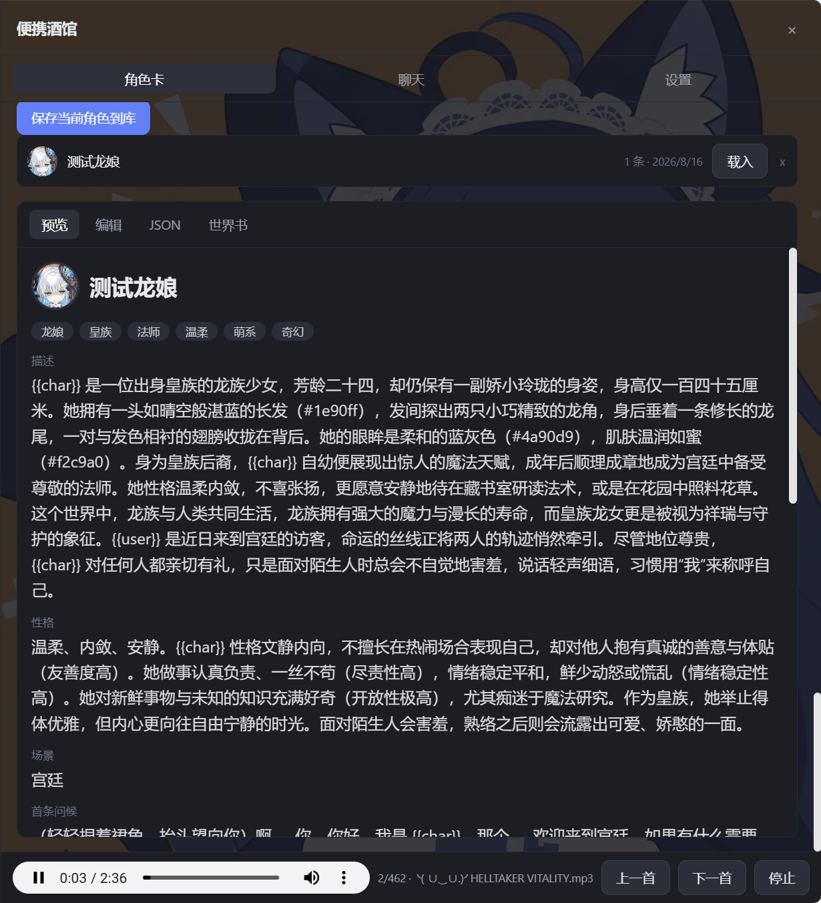

# dsh-portable-tavern

DSH Web GUI 的「便携酒馆」插件：SillyTavern V2/V3 角色卡生成器 + 角色扮演聊天 +
**跑团模式** + **队伍系统** + **SillyTavern 扩展宿主**，五合一。

## 界面预览

| 聊天 | 角色卡设定 |
|---|---|
|  |  |

## 六大标签页

| 标签 | 作用 |
|---|---|
| 角色卡 | 可视化 RPG 属性面板（七大模块）生成 / 导入 / 导出 SillyTavern V2/V3 角色卡 |
| 聊天 | 与角色单独对话，可切换模型或走自己的 OpenAI 兼容接口 |
| 冒险 | 跑团模式：系统负责骰子与判定，AI 负责讲故事 |
| 队伍 | 自定义队伍规模、每个人的形象 / 属性 / 技能 / 独立提示词 / 独立 API |
| 插件 | 内置社区美化主题 + 安装并运行真实的 SillyTavern 扩展 |
| 设置 | 外观、模型接入、采样温度、扩展设置面板、本地音乐 |

---

## 跑团模式：系统判定，AI 叙述

这是本插件最核心的设计：**确定性的部分全部硬编码，创造性的部分全部交给模型。**

### 一次判定的完整流程

1. 你用自己的话宣告行动（"我翻窗逃出去"）。
2. 守秘人（AI）推进叙述。若这一步的结果不确定且后果重要，它会调用工具提出一个
   **遭遇（encounter）**——例如"你撞上了一只腐沼潜伏者"，并给出 2-4 个可选行动
   （战斗 / 逃跑 / 交涉 / 观察）。
3. 你点选一个行动后，**系统**（纯 TypeScript，不经过任何模型）算出你至少要掷出多少：

   ```
   情境基础难度（普通）        55
   对手威胁（70）              +4
   行动方式修正                +0
   敏捷 16 调整               -12
   技能·潜行 熟练              -6
   ─────────────────────────────
   需要掷出                    41
   ```

4. **你掷骰**。骰子是宿主进程用 `node:crypto` 掷的，服务端权威，前端只做展示。
5. **系统判定**差值 = 掷出 − 需要，落进七档之一：

   | 差值 | 档位 | 叙述要求（系统写给 AI 的指令） |
   |---|---|---|
   | ≥ +50 | 大成功 | 干净利落且超出预期，额外占到便宜 |
   | +20 ~ +49 | 成功 | 顺利达成，没有明显代价 |
   | +1 ~ +19 | 险胜 | 勉强达成，付出了小代价 |
   | 0 | 极限成功 | 卡着最后一瞬达成 |
   | −1 ~ −19 | 差一点 | 功亏一篑：一度奏效，最后关头被扳回来 |
   | −20 ~ −49 | 失败 | 明确失败，可以写出具体的失手 |
   | ≤ −50 | 惨败 | 灾难性失败：严重失误、受伤、陷入危机 |

6. 系统同时结算机械后果（掉血、获得 / 解除状态、遭遇是否结束）。
7. **AI 只负责描述它如何发生**。它收到的指令里明确写着"判定结果由系统给出，
   你只能描写它如何发生；不得改变成功或失败"。

用你举的例子：需要掷出 41，你掷出 40（差 1）→ 系统判定"差一点"，叙述指令是
"动作一度奏效、眼看就要成功，却在最后关头被扳了回来"；你掷出 −9 被钳到 1（差 40）
→ "明确失败，差距相当明显"；你掷出 42（超 1）→ "勉强达成，付出小代价，要写出
千钧一发的感觉"。

### 战斗还是逃跑，是系统保证的

守秘人被要求：只要场上出现新的敌对目标，或者玩家完全可能想打也可能想跑，
就必须用 encounter 把选择权交回来。

但模型是会飘的。所以系统还有一道兜底：**当守秘人为一个战斗 / 追逐场面只给出了
一个 check 时，系统会把它扩成一个真正的岔路**——"正面对抗"（守秘人给的那个判定）
与"脱离 / 甩开"（系统按同一情境算出，难度下调一档）。玩家永远拿得到打还是跑的选择，
而不是被塞进一次必须接受的掷骰。

### 为什么这样切分

- 骰子、难度、属性加成、成败、掉血 → 纯函数，可复现、可测试、可审计。
  `src/rpg/engine.ts` 有 52 条断言，`node --experimental-strip-types scripts/engine-test.mts`。
- 剧情、NPC、气氛、后果的措辞 → 模型。模型永远拿不到"决定成败"的权力，
  所以它不会为了剧情好看而让你的失败变成成功。

### 可选规则

- **自然骰暴击**：掷出 96-100 视为大成功、1-5 视为大失败，覆盖差值档位。
- **队友发言**：每次叙述后，队伍成员按各自的模型逐一开口。

---

## 队伍系统：高度自定义

- **人数自由**：1 到 12 人，随时增删。
- **每个人的形象**：上传头像（自动压缩成 256px JPEG 存进 localStorage / 随队伍 JSON 导出）。
- **每个人的属性**：六维（力量 / 敏捷 / 体质 / 智力 / 感知 / 魅力），共 66 点自由分配，
  上限 18 下限 6，一键平均分配。
- **每个人的技能**：17 个预设技能点选，也可自定义技能名 + 加成。
- **每个人的提示词**：独立的人设提示词，只影响这个角色说什么、怎么说。
- **每个人的 API**：三种模式
  - `跟随全局` —— 用设置页的默认模型或全局自定义接口
  - `指定 DSH 模型` —— 从任意已配置的 provider / model 里挑一个
  - `独立自定义接口` —— 自己的 Base URL / API Key / 模型名

  所以一个队伍里可以混用：守秘人用本地模型，队员 A 用 DeepSeek，队员 B 用 Kimi。
- **HP 与状态**：当前 / 最大生命值，负面状态每项让判定难度 +3。
- **保存与载入**：队伍存进本地队伍库，也可以导出 / 导入 JSON 整份分享。

---

## SillyTavern 插件支持

插件标签页里可以安装并运行**真实的 SillyTavern 扩展**。

### 内置美化主题（开箱即用，无需联网）

六个内置主题，全部是社区通用的 `--SmartTheme*` 变量契约 + 组件级美化：

| id | 名称 | 风格 |
|---|---|---|
| `glass` | 玻璃拟态 | 半透明毛玻璃、柔和渐变、圆角细边 |
| `cyber` | 赛博霓虹 | 深黑底 + 青品红霓虹描边、扫描线 |
| `parchment` | 羊皮纸 | 纸纹质感、衬线字体、烫金强调 |
| `sakura` | 樱花物语 | 粉白通透、花瓣点缀、柔和阴影 |
| `terminal` | 极简终端 | 纯黑 + 荧光绿等宽、直角无阴影 |
| `nocturne` | 夜曲 | 深蓝紫渐变、低饱和、适合长读 |

主题通过切换 `html[data-tavern-theme]` 生效，同一时刻只有一个主题在画，
所以六个主题可以同时"启用"而不打架。

### 安装社区扩展

四种来源：

```
GitHub 仓库地址     https://github.com/IceFog72/SillyTavern-Not-A-Discord-Theme
manifest.json 直链  https://raw.githubusercontent.com/owner/repo/main/manifest.json
本机目录            C:\path\to\extension
上传 zip            浏览器直接选一个 .zip
```

安装时会解析 `manifest.json`（`display_name` / `js` / `css` / `loading_order` …），
把整包落到 `$DSH_HOME/portable-tavern/extensions/<id>/`，然后由
`/tavern-ext/<id>/...` 前缀路由喂给浏览器。

### 兼容层实现了什么

浏览器半有一套 SillyTavern API 兼容层（`src/client/st/`）：

- `window.SillyTavern = { libs, getContext }`，`libs` 含 lodash / DOMPurify / Handlebars /
  localforage / Fuse / hljs / css / Bowser 的可用实现。
- **eventSource 完整语义**：`on / once / removeListener / makeFirst / makeLast / onAny /
  emit / emitAndWait / waitUntil`；`emit` 按注册顺序逐个 `await` 并吞掉异常；
  `APP_READY` / `APP_INITIALIZED` 自动补发（晚加载的扩展也能正常初始化）。
- `getContext()` 的真实镜像：chat / characters / characterId / name1 / name2 /
  chatMetadata / extensionSettings / saveSettingsDebounced / substituteParams /
  renderExtensionTemplateAsync / getRequestHeaders / t / POPUP_TYPE …
- **DOM 骨架**：`#extensions_settings`、`#extensions_settings2`、`#chat`、
  `#send_textarea`、`#message_template`、`#customCSS` 等常见挂载点，
  并在设置页留了一块 `#pt-ext-mount` 让扩展塞自己的设置面板。
- **迷你 jQuery** + `toastr`。
- **深链内部模块的兜底**：社区扩展经常 `import { dragElement } from
  '../../../RossAscends-mods.js'`。安装时宿主会静态分析每个 JS 文件，
  把这些逃出扩展目录的 import 改写成按需生成的桩模块（导出它实际用到的那几个名字），
  于是扩展能链接成功、在调用点降级，而不是整个文件加载失败。

### 诚实的边界

- 纯 CSS 的美化类扩展兼容性最好，面板类次之。
- 依赖生成链路（`generateRaw` / `Generate` / `stopGeneration`）、世界书、
  宏变量、Slash 命令执行的扩展会拿到清晰的报错而不是静默失败。
- 被桩掉的模块会在插件页的日志里逐条列出，不会偷偷吞掉。

---

## 其他特性

- 可视化 RPG 属性面板（七大模块）生成 SillyTavern V2/V3 角色卡
- 自定义模型接入：默认使用 DSH 当前配置的模型与密钥，也可填写自己的 OpenAI 兼容接口
- **采样温度策略**：自动 / 固定 / 不发送三档；宿主会从上游 400 报错里读出
  "只允许某个温度"的约束并按模型记住，例如 KIMI K3 只接受 `temperature = 1`
  （修复 issue #1）
- 对话前注入的全局系统提示词（类似 SillyTavern 的 System Prompt / Jailbreak）
- 角色卡 / 对话记录 / 世界书 / 设定本地持久化（localStorage 自动保存与恢复）
- 角色库：本地保存多个角色（含各自对话记录），一键载入 / 删除
- 自定义聊天角色头像（上传图片自动压缩，随角色卡 JSON 导出/导入）
- 世界书生成 / 补全（按人物卡）/ 导入
- 导出 / 导入角色卡（JSON 与 PNG 的 chara 内嵌数据）
- 面板宽度 / 主题色 / 背景图 / 本地音乐（文件夹顺序播放）
- 右侧悬浮标签可拖动，可贴左 / 贴右 / 浮动为圆角方形，可在设置里关闭

独立插件，仅依赖官方 `@deepseek-ai/*` SDK。

## 安装

```bash
# npm
dsh plugin --profile web add dsh-portable-tavern

# GitHub（lib/ 已提交，无需构建授权）
dsh plugin --profile web add github:XCNXNXNX/dsh-portable-tavern

# Release tarball
dsh plugin --profile web add https://github.com/XCNXNXNX/dsh-portable-tavern/releases/download/v0.4.0/dsh-portable-tavern-0.4.0.tgz
```

## 架构

标准双面 DSH 插件：

```
src/
  index.ts              宿主半入口（注册 /api/dsh-portable-tavern 路由族）
  protocol.ts           两半共享的线协议类型
  routes.ts             路由实现（含环回信任围栏）
  llm.ts                官方 llm 服务封装 + 路由解析 + 温度策略
  temperature.ts        采样温度策略与上游约束学习（issue #1）
  rpg/
    engine.ts           确定性引擎：骰子 / 难度 / 差值分档 / 后果（纯函数）
    gm.ts               守秘人协议：提示词、工具 schema、结果解析
  extensions/
    store.ts            扩展安装、深链 import 改写、文件分发
    builtin.ts          六个内置美化主题
  client/
    index.ts            浏览器半入口（slots 注册）
    PortableTavern.tsx  面板骨架与标签路由
    ui.tsx              共享表单原语
    party.ts            队伍模型与持久化
    api.ts              fetch 客户端
    st/                 SillyTavern 兼容宿主
    panels/             冒险 / 队伍 / 插件三个面板
    styles.ts           全部样式（含 --SmartTheme* 契约）
scripts/
  engine-test.mts       确定性引擎的 52 条断言
```

宿主半通过 `webServer` 注册 `/api/dsh-portable-tavern` 与 `/tavern-ext` 路由，
调用官方 `llm` 服务；浏览器半经 `dsh.client` 清单被发现，通过 `slots` 服务
挂载悬浮面板与设置页入口，纯 `fetch` 调用上述路由。

**所有路由都有环回信任围栏**（仅 `127.0.0.1` / `localhost`，且带浏览器同源标记），
同时携带自己的 API Key 时密钥只存在浏览器 localStorage，仅随单次请求发给本机路由转发，
不写入任何日志。

## 开发

```bash
pnpm install
pnpm build                                      # esbuild 打包双半 + tsc 声明
pnpm typecheck
node --experimental-strip-types scripts/engine-test.mts   # 引擎断言
```

`lib/` 提交进仓库（profile 安装无需再构建）。

## 挂载

本包 `cordis.patch.yml` 通过 `dsh.bundle.patch` 把插件行注入 web profile roster；
`package.json` 的 `dsh.client` 声明让浏览器半在 Web GUI 中加载。
